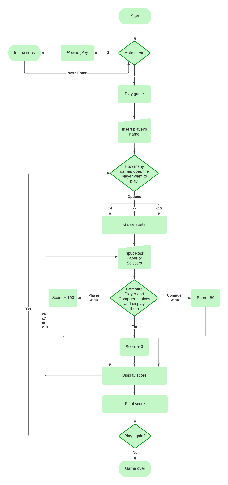
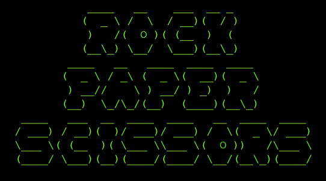
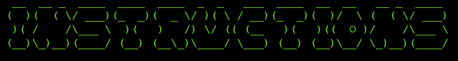
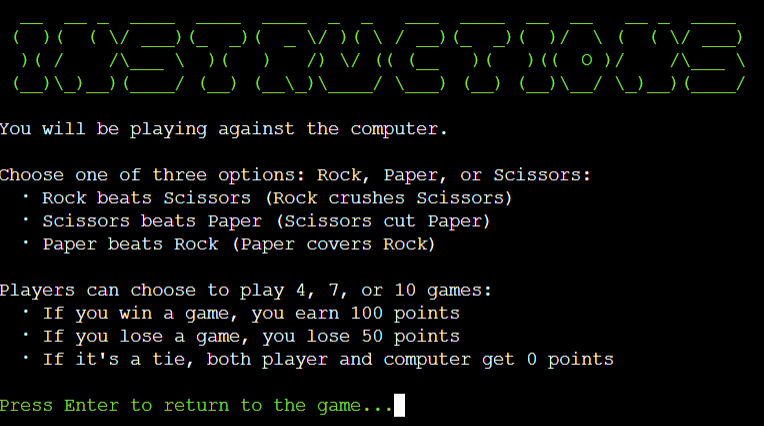
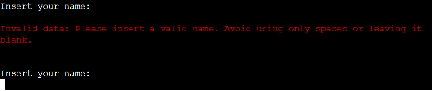
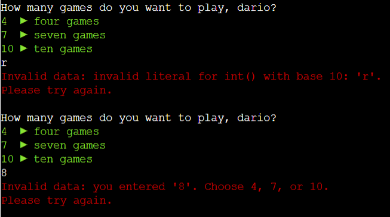

# Rock Paper Scissors

Rock, Paper, Scissors Game: Challenge the computer to a classic game of Rock, Paper, Scissors.

In this Python game, you can choose to play 4, 7, or 10 rounds. Test your luck as you pick between Rock, Paper, and Scissors.

Remember the rules: Rock beats Scissors, Scissors beats Paper, and Paper beats Rock. Win a game to earn 100 points, lose and lose 50 points, or tie with the computer for no points.

## Live site

[Rock Paper Scissors](https://rock-paper-scissors-pp3-b3c7dd81e311.herokuapp.com/) _(Ctrl + click to open in a new tab)_

## Project Goals

The project aims to create an engaging Rock, Paper, Scissors game with variable rounds and player-versus-computer gameplay.
It focuses on implementing and adhering to the classic game rules, ensuring clear user instructions, and a smooth game flow. The game tracks and displays scores for both the player and the computer while maintaining a randomized element in the computer's choices. Comprehensive documentation and error-handling mechanisms are essential for user guidance and a seamless gaming experience. Optional considerations include code optimization and potential enhancements based on user feedback.

## User Experience (UX)

### Target Audience

The target audience for this Rock, Paper, Scissors game is broad and inclusive, designed for individuals of all ages and backgrounds who enjoy casual gaming experiences. This classic game's simplicity and universal appeal make it suitable for a wide range of players. Additionally, technology enthusiasts looking to explore game development in Python, using ASCII art and libraries, will find this project a valuable resource.

### User Requirements and Expectations

Users can expect a user-friendly interface with clear instructions for easy gameplay. The implementation of traditional game rules ensures a familiar experience. Furthermore, players have the choice to play 4, 7, or 10 rounds, accommodating both quick sessions and longer challenges. The aim is to deliver a smooth and enjoyable experience.

### User Stories

#### First-Time User:

As a first-time user of the Rock, Paper, Scissors game, I want a straightforward and intuitive interface that guides me through the game. I expect clear instructions on how to make my choice (Rock, Paper, or Scissors) and understand the rules. I'm looking for an enjoyable experience that introduces me to the world of Python game development while keeping the gameplay simple and engaging.

#### Returning User:

I'm interested in the option to choose different numbers of rounds for added variety. My goal is to continue enjoying quick, casual gaming sessions.

#### Frequent User:

As a frequent user of the Rock, Paper, Scissors game, I seek a reliable and consistent experience. It would be great to see some advanced features or improvements over time, such as enhanced graphics or additional game modes.

### Flow Chart

[Lucidchart](https://www.lucidchart.com/pages/) was utilized to design the program's flow, resulting in the creation of a flowchart that visually represents the user flow through the application.

## Design

### Color scheme

The Rock, Paper, Scissors game incorporates the Colorama library to improve visual clarity and user interaction. The color choices serve specific purposes:

- RED: used for error messages to make them easily noticeable and help users quickly identify and address any issues.

- LIGHTGREEN_EX: used for user choices, making them distinct and easily recognizable in the game.

- LIGHTCYAN_EX: for displaying user and computer choices, as well as the score display.

These color choices aim to enhance the user experience by improving visual distinction and clarity throughout the game.

### Imagery

Incorporating imagery has been a key aspect of the Rock, Paper, Scissors game's visual appeal. [Patrojk](https://patorjk.com/software/taag/#p=display&f=Graffiti&t=Type%20Something%20) was used to create the game title and the instruction page title. Patrojkwas is a tool that convert text to a font in Ascii format.

ASCII art symbols for Rock, Paper, and Scissors hands were also used. They serve a functional purpose by making it easy for users to identify their choices and grasp the game's fundamental mechanics at a glance.

The careful integration of these ASCII art elements aims to enhance the overall presentation of the game, adding creativity while ensuring clarity and user-friendliness remain uncompromised.

## Features

#### Game Menu

On the main screen of the Rock Paper Scissors game, players are greeted with a menu offering two options:

- Play: This option starts a new game.
- How to Play: Here, players can access instructions explaining how to participate in the game.

If a player chooses an invalid option from the menu, the system displays an error message. It then guides the player on how to make a correct selection, prompting them to choose again until a valid choice is made.

### How to play

The game includes an instruction section that players can open. This section provides clear guidance on playing against the computer, making choices (Rock, Paper, or Scissors), and understanding the scoring system based on game results.

#### Player Name Input

In the player name input section, the player is asked to enter their name. If the name entered consists only of spaces or is left blank, an error message will appear, prompting the player to avoid using only spaces or leaving the field empty.

#### Number of Games Input

Players can select to play 4, 7, or 10 games giving them flexibility in tailoring the length of their gaming session to their liking.

If an incorrect input is entered, a data validation check will run before allowing the program to proceed further. This validation process serves to identify any errors. In the event of wron input the system will promptly display a helpful error message, explaining the issue to the user, and guiding them on how to rectify it, ensuring a smooth and user-friendly experience.

### Score

The game's score system awards players 100 points for a win, deducts 50 points for a loss, and provides 0 points for a tie. Importantly, it has been designed to prevent scores from going below zero.

### End of game

At the end of the game, the player is asked if they want to play again with a yes or no question. If they choose "yes," they are redirected to the game setup to choose the number of games for a new session. If they select "no," the game ends, and a thank you message is displayed.

### Future Implementations

As a potential future improvement, I plan to implement a leaderboard feature in the game.

## Technologies used

- Language
  - The primary language employed in this project is [Python](https://www.python.org/). Link to the [code](https://github.com/Darioc18/rock-paper-scissors/blob/main/run.py)
- Frameworks and Programs
  - [Git](https://developer.mozilla.org/en-US/docs/Glossary/Git)
  - [Github Pages](https://github.com/)
  - [Visual Studio Code](https://code.visualstudio.com/)
  - [Heroku](https://heroku.com/)
  - [Google Dev Tools](https://developer.chrome.com/docs/devtools/open/)
  - [Google Lighthouse](https://developer.chrome.com/docs/lighthouse/overview/)
  - [Code Institutes Pep8 Checker](https://pep8ci.herokuapp.com/)
  - [Lucid Chart](https://www.lucidchart.com/)
  - [Favicon.io](https://favicon.io/)
- Modules Imported
  - [os](https://docs.python.org/3/library/os.html) - Provides access to the operating system, allowing interaction with files and system-specific functions.
  - [time](https://docs.python.org/3/library/time.html) - Enables the introduction of sleep delays in the terminal user interface to control timing.
  - [colorma](https://pypi.org/project/colorama/) - Enhances terminal text with color.
  - [sys](https://docs.python.org/3/library/sys.html) - Controls text animations, including sleep times between characters, for visual effects in the game.

## Testing

Find a detailed summary of all testing procedures in the [TESTING.md](TESTING.md) file.

## Bugs

| BUGS                                                                                                                                                                                                                              | FIX                                                                                                                                                                                                                                                                                                                                                                                                                                                                                                                                                                                                                                                                                            |
| --------------------------------------------------------------------------------------------------------------------------------------------------------------------------------------------------------------------------------- | ---------------------------------------------------------------------------------------------------------------------------------------------------------------------------------------------------------------------------------------------------------------------------------------------------------------------------------------------------------------------------------------------------------------------------------------------------------------------------------------------------------------------------------------------------------------------------------------------------------------------------------------------------------------------------------------------- |
| When attempting to initiate a new game by selecting 'y' when prompted with _Do you want to play again? (y/n)_, the game was not restarting.                                                                                       | To resolve this issue, I incorporated the following code snippet into the main function (refer to line 312), and it successfully addressed the problem: <pre>if not play_again():     break</pre>                                                                                                                                                                                                                                                                                                                                                                                                                                                                                           |
| While implementing a while loop to validate the input in the _get_player_name_ function, specifically ensuring that it was not empty or consisted solely of spaces, I encountered an issue where it wasn't functioning correctly. | To address this, I made adjustments to the if statement. I replaced the previous condition <pre>if ((player_name == "") and (player_name.count(' ') > 0)):</pre> with <pre>if player_name.strip() == "":</pre> (refer to line 34), which resolved the problem."                                                                                                                                                                                                                                                                                                                                                                                                                                |
| The animation generated in _shoot_animation_ function didn't display properly after deploying the website.                                                                                                                        | After a code review session with my mentor, we identified the issue within the _clear_terminal_ function. To ensure cross-compatibility with different operating systems, I made updates to the _clear_terminal_ function (used within the _shoot_animation_ function), resolving the problem. Initially the _clear_terminal_ function was: <pre>def clear_terminal():     """     Clears the terminal.     """     os.system('cls&#124;&#124;clear')</pre> The updated function now is: <pre>def clear_terminal():     """     Clears the terminal.     """     if os.name == "nt":     os.system('cls')     else:     os.system('clear')</pre> |

## Deployment

The game has been successfully deployed on Heroku.

### Code Institute Python Essentials Template

This template adds in the necessary front-end files to give the users a way to interact with the project in a mock terminal on a web page, once the project is deployed.
In the template page click on _Use this template_ and then _Create a new repository_.

### Deployment on Heroku

1. Log in to [Heroku](https://www.heroku.com/).
2. From the Heroku dashboard click the _Create New App_.
3. Provide a name for the app and select a region.
4. Click the _Create app_ button.
5. Navigate to the _Settings_ tab in the navigation bar.
6. In the _Config Vars_ section, also known as environment variables, is where you would store sensitive data that needs to be kept secret, for example a creds.json file. I don't have any json for this project so I just added a _Config Var_ where key is PORT and value is 8000.
7. Select _Add buildpack_ and add python and nodejs making sure they are in this order.
8. Now our project settings are done, we can go to the _Deploy_ section and choose our deployment method.
   Select Github, and then we can confirm that we want to connect to Github.
9. Search for the Github repository name and then click _Search_. And then we can click _connect_ to link up our Heroku app to our Github repository code.
10. Now we can set up automatic deploys, if you choose to enable this then Heroku will rebuild your app every time you push a new change to your code to Github. Or you can choose to manually deploy using the _Deploy Branch_ option here.
11. And finally we see the _App was successfully deployed_ message and a button that take us to the deployed link.

### How to Fork the repository

1.  Go to the [GitHub repository](https://github.com/Darioc18/memory-game);
2.  In the top-right corner of the page, click _Fork_;
3.  Optionally type the _Repository name_ and _Description_;
4.  Click the green button _Create fork_.

### How to Clone The Repository

1. Go to the [GitHub repository](https://github.com/Darioc18/memory-game);
2. Above the list of files, click the green button _Code_;
3. Choose your preferred method for cloning: HTTPS, SSH, or Github CLI. Click the copy button to copy the URL to your clipboard.
4. Open Git Bash.
5. Change the current working directory to the location where you want the cloned directory.
6. Type git clone, and then paste the URL you copied earlier.
7. Press Enter. Your local clone will be created.

## Credits

### Code

- [Code Institute Essentials Template](https://github.com/Code-Institute-Org/python-essentials-template)

### Media

- [Patrojk](https://patorjk.com/software/taag/#p=display&f=Graffiti&t=Type%20Something%20) was used to generate the game title and the instruction page title.
- I sourced the ASCII art hand gestures from [asciiart.eu](https://www.asciiart.eu/people/body-parts/hand-gestures)
