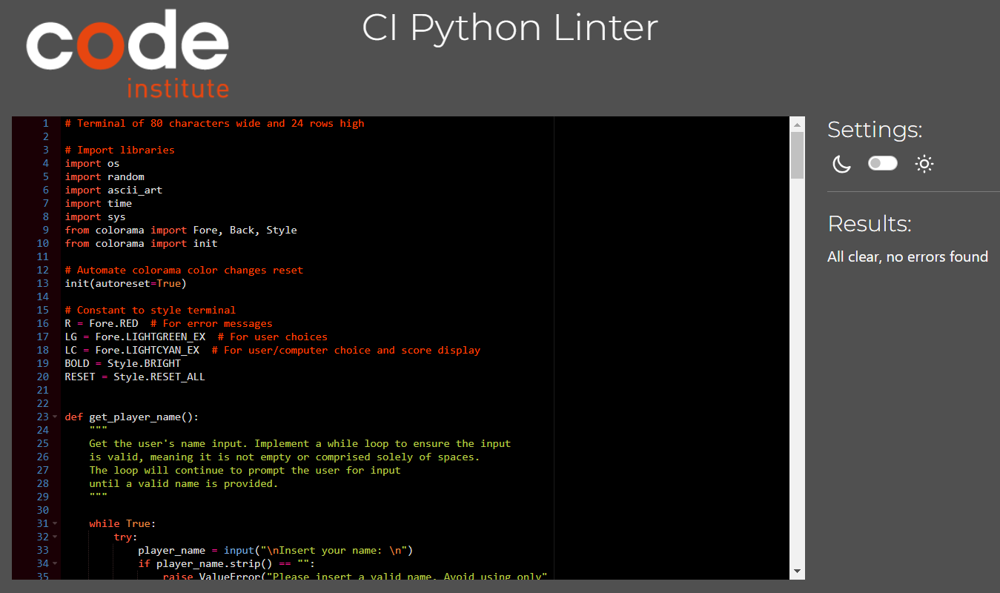
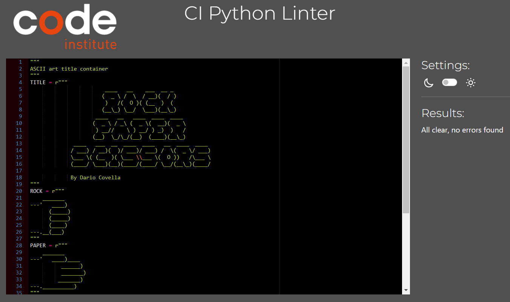
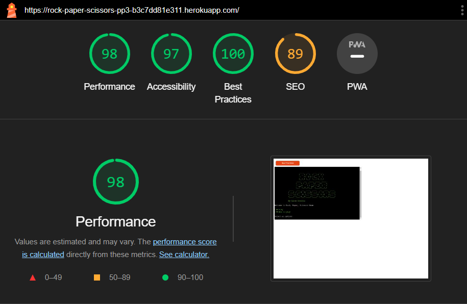

# Testing Rock Paper Scissors

## CI Python Linter

The code has been tested using the [CI Python Linter](https://pep8ci.herokuapp.com/), which found no errors and confirmed adherence to coding standards. Both run.py and ascii_art.py were examined during this process.

- run.py
  

- ascii_art.py
  

## Lighthouse

Google Lighthouse in Google's Chrome Developer Tools was used to test the performance of the website. All elements performed well.

## Testing User Stories

- **First-Time User:** my goal is to easily navigate the game interface, understand the rules, and have a smooth initial gaming experience. I expect clear instructions and a user-friendly interface to help me get started.

  - _Clear Instructions: detailed and easily understandable instructions have been provided to guide new users through the game and its rules._
  - _User-Friendly Interface: The game interface has been designed with simplicity and clarity to ensure a smooth and enjoyable experience for newcomers._

- **Returning User:** I want to quickly resume gameplay, benefiting from a familiar interface and a seamless transition into new sessions. I want to efficiently use the 'Play Again' feature.

  - _A 'Play Again' feature has been implemented that allows returning users to quickly restart the game or choose new settings._

- **Frequent User:** my goal is to have a consistently enjoyable gaming experience. I look forward to any enhancements or optimizations based on my feedback, making the game even better over time. I anticipate providing feedback to help refine the game's interface and functionality.
  - _Based on user feedback, ongoing updates and improvements will be made to the game to enhance its overall experience and functionality over time._

## Manual Testing

| Feature                | Action                                           | Expected result                                                                                                                                                                                                                                                                                     | Tested | Passed |
| ---------------------- | ------------------------------------------------ | --------------------------------------------------------------------------------------------------------------------------------------------------------------------------------------------------------------------------------------------------------------------------------------------------- | ------ | ------ |
| Game Menu              | Input _1 ► Play_                                 | The game starts                                                                                                                                                                                                                                                                                     | ✔      | ✔      |
| Game Menu              | Input _2 ► How to play_                          | Instructions are displayed                                                                                                                                                                                                                                                                          | ✔      | ✔      |
| Game Menu              | Input any keys except for _1_ or _2_.            | Message displayed: _Invalid selection. Select '1' to Play or '2' to read How to play._                                                                                                                                                                                                              | ✔      | ✔      |
| Instructions           | Press Enter                                      | Return to the main menu                                                                                                                                                                                                                                                                             | ✔      | ✔      |
| Name Input             | Input any characters or numbers                  | Redirected to the next input query                                                                                                                                                                                                                                                                  | ✔      | ✔      |
| Name input             | Input only spaces or leave the field blank       | Message displayed: _Invalid data: Please insert a valid name. Avoid using only spaces or leaving it blank._                                                                                                                                                                                         | ✔      | ✔      |
| Number of Rounds Input | Input _4_, _7_, or _10_                          | Redirected to the next input query                                                                                                                                                                                                                                                                  | ✔      | ✔      |
| Number of Games Input  | Input any keys except for _4_, _7_, or _10_.     | Message displayed: _Invalid data: invalid literal for int() with base 10: '{character}'. Please try again._ if the entered string is either empty or contains characters other than digits, or: _Invalid data: you entered '{number}'. Choose 4, 7, or 10. Please try again._ if digits are entered | ✔      | ✔      |
| Choice input           | Input _r ► Rock_, _p ► Paper_, or _s ► Scissors_ | The computer randomly selects its option, and in each round, the player's choice and the computer's choice are compared and the score assigned                                                                                                                                                      | ✔      | ✔      |
| Choice Input           | Input any keys except for _r_, _p_, or _s_       | Message displayed: Invalid data: You entered '{key}'. Choose 'r' for rock, 'p' for paper, 's' for scissors. Please try again.                                                                                                                                                                       | ✔      | ✔      |
| Play again             | Input _y_                                        | The player gets redirected to select the number of rounds                                                                                                                                                                                                                                           | ✔      | ✔      |
| Play again             | Input _n_                                        | The game ends and a thank you message is displayed                                                                                                                                                                                                                                                  | ✔      | ✔      |
| Play again             | Input any keys except for _y_ or _n_             | Message displayed: _Invalid input. Select 'y' to play again or 'n' to end the game_                                                                                                                                                                                                                 | ✔      | ✔      |
